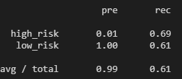
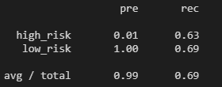
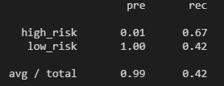
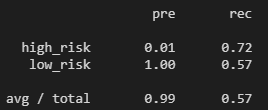
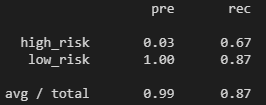
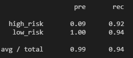

# Credit Risk Analysis

## OVERVIEW OF ANALYSIS

Using a provided credit card dataset, various resampling models were used to access credit risk.

### Algorithms Used
- RandomOverSampler 
- SMOTE
- ClusterCentroids
- SMOTEENN
- BalancedRandomForestClassifier 
- EasyEnsembleClassifier

---

## RESULTS

### Balanced Accuracy, Precision, and Recall Scores for each algorithm
- **RandomOverSampler**
    
    Balanced Accuracy Score: **0.65**

    

    Preicision: **0.99**

    Recall: **0.61**

    

- **SMOTE**
    
    Balanced Accuracy Score: **0.66**

    

    Preicision: **0.99**

    Recall: **0.69**

    

- **ClusterCentroids**
    
    Balanced Accuracy Score: **0.64**

    

    Preicision: **0.99**

    Recall: **0.42**

    

- **SMOTEENN**
    
    Balanced Accuracy Score: **0.58**

    

    Preicision: **0.99**

    Recall: **0.57**

    

- **BalancedRandomForestClassifier**
    
    Balanced Accuracy Score: **0.77**

    

    Preicision: **0.99**

    Recall: **0.87**

     

- **EasyEnsembleClassifier**
    
    Balanced Accuracy Score: **0.93**

    

    Preicision: **0.99**

    Recall: **0.94**

     

---

## SUMMARY

In conclusion, it can be said that the ensemble classifiers vastly outperformed their more basic counterparts in both accuracy and recall scores. All models returned 99% precision, as the dataset was extremely lopsided towards low-risk applications.

The EasyEnsembleClassifier model returned the best scores, and therefore would be the recommended model to use going forward.
